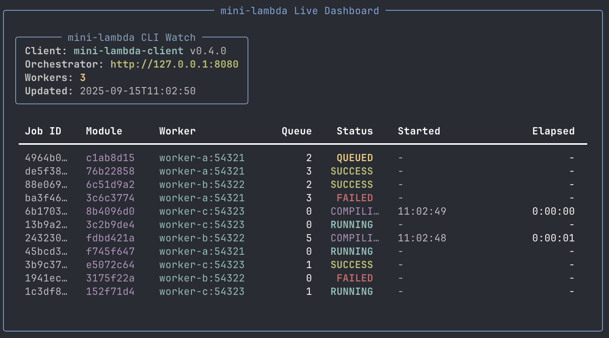

# mini-lambda



## Overview

mini-lambda is a lightweight, Rust-powered serverless compute platform for running WebAssembly in distributed sandboxed worker processes.

## Status

**In development!** APIs and internals are changing frequently so expect breaking changes while the project evolves

## Key features

- **Serverless execution:** Run uploaded WebAssembly modules in a sandboxed environment.
- **Low latency:** Ahead-of-time compilation and caching to target sub-50ms cold start times.
- **Distributed orchestration:** Workers dynamically register and receive jobs from an orchestrator.
- **Secure runtime:** Sandbox isolation with restricted capabilities.
- **Scalable design:** Architecture designed to scale horizontally across 100+ distributed nodes.

---

## Quickstart

**Prereqs:** Rust, cargo.

1. Start the orchestrator (choose bind address):
   ```bash
   cargo run -p mini-lambda-orchestrator -- --bind 127.0.0.1:8080
   ```

2. Start one or more workers (each binds to an OS assigned port and registers with the orchestrator):
   ```bash
   cargo run -p mini-lambda-worker -- --orchestrator 127.0.0.1:8080
   ```

3. Submit WASM jobs from the client:
   ```bash
   cargo run -p mini-lambda-client -- crates/client/test-wasm/test-wasm.wasm
   ```
   - By default the client contacts `http://127.0.0.1:8080` (the default orchestrator). See CLI options below.

---

## CLI / runtime options

- Orchestrator
  - `--bind <ADDR:PORT>` (default: `127.0.0.1:8080`)
    - Example: `cargo run -p mini-lambda-orchestrator -- --bind 0.0.0.0:8080`

- Worker
  - `--orchestrator <ORCH_URL>` (required)
    - Examples:
      - `cargo run -p mini-lambda-worker -- --orchestrator 127.0.0.1:8080`
      - `cargo run -p mini-lambda-worker -- --orchestrator http://127.0.0.1:8080`

- Client
  - Positional: path to `.wasm` file
  - `--server <ORCHESTRATOR_URL>` (default: `http://127.0.0.1:8080`)
    - Example:
      ```bash
      cargo run -p mini-lambda-client -- test-wasm/test-wasm.wasm --server http://127.0.0.1:8080
      ```

---

## Testing

There are a few small unit tests included in the most stable pieces of the codebase (so far):

- Orchestrator: tests for WorkerRegistry (register, pick_and_increment, update_queue, unregister).
- Worker: tests for ModuleCache (LRU bheavior) and QueueTicket (RAII counter behavior).

Note: most of the CLI and networking code is still evolving, so tests currently focus on these more stable parts for now.

Run tests:
- All workspace tests:
  ```bash
  cargo test
  ```

--

## Contributing

This project is early stage so contributions, ideas, bug reports are welcome! Feel free to open an issue or PR, or contact me at elliotthfaa@gmail.com!