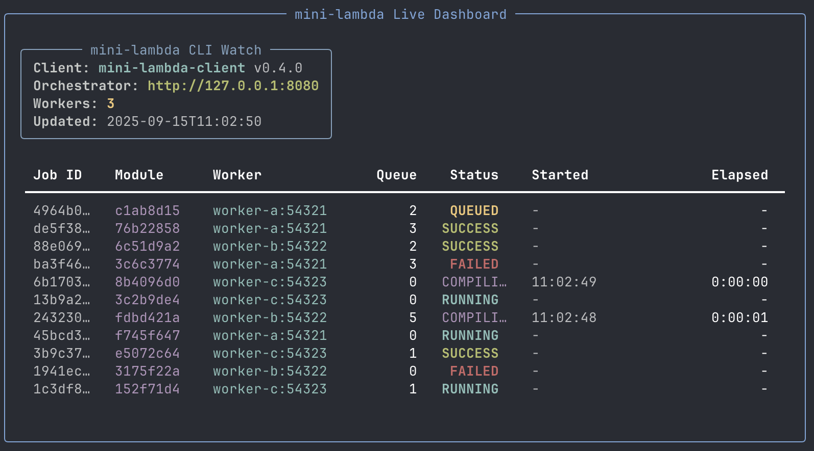

# mini-lambda



## Overview

`mini-lambda` is a lightweight, Rust-powered serverless compute platform for running WebAssembly in distributed workers over gRPC.

## Key features

- **Serverless WASM execution:** Runs WebAssembly components on remote workers using Wasmtime with WASI Preview 2 support.
- **Ahead-of-time compilation:** Modules are compiled once on the worker and cached by content hash, no repeated JIT overhead.
- **Distributed worker pool:** Workers register dynamically with the orchestrator over gRPC; the orchestrator queues and dispatches jobs across them.
- **Credit-based scheduling:** Workers advertise available capacity; the orchestrator uses credits to load-balance without oversubscribing any node.
- **Full job lifecycle:** Jobs move through Queued → Dispatched → Compiling → Executing → Completed / Failed / Cancelled. Cancellation is supported at any stage.
- **Optional authentication:** Password-protected access per role (client, worker), with JWT-based job authorization between orchestrator and worker.
- **TUI dashboard:** Run the orchestrator with `--tui` for a live terminal dashboard; sortable job, worker, and client tables with integrated log viewer.

---

## Architecture

The client sends a job request to the orchestrator, which queues it until a worker with sufficient capacity is available. The orchestrator then assigns the job to a worker and returns the worker's address along with a JWT scoped to that job. The client uses these to connect directly to the worker, sending the `.wasm` bytes and arguments, and receiving the final result. The orchestrator maintains a persistent bidirectional gRPC stream with each worker for job dispatch and status updates.

```
┌────────┐  1. request worker   ┌──────────────┐
│        │ ───────────────────→ │              │
│ Client │                      │ Orchestrator │
│        │ ←─────────────────── │              │
└────┬───┘  2. worker addr + JWT└──────────────┘
     │                                 ↕  (persistent stream)
     │                          ┌─────────────┐
     │   3. send wasm + args    │             │
     ├────────────────────────→ │   Worker    │
     │   4. receive result      │             │
     ←──────────────────────────└─────────────┘
```

---

## Quickstart

**Prerequisites:** Rust toolchain (`rustup`).

1. **Start the orchestrator:**
   ```bash
   cargo run -p orchestrator -- 127.0.0.1:50051
   ```

2. **Start one or more workers** (each needs a bind host and an initial credit count):
   ```bash
   cargo run -p worker -- 127.0.0.1 100
   ```

3. **Submit a job:**
   ```bash
   cargo run -p client -- crates/client/test-wasm/test-wasm.wasm
   ```

Workers register with the orchestrator and accept jobs from clients directly. Running locally with `127.0.0.1` works fine; for distributed deployments, use publicly reachable IPs or hostnames for both the orchestrator and each worker.

---

## CLI Reference

### Orchestrator

| Argument | Default | Description |
|---|---|---|
| `addr` (positional) | `127.0.0.1:50051` | Address and port to bind to |
| `--worker-password` | none | Password workers must supply to register |
| `--client-password` | none | Password clients must supply to submit jobs |
| `--tui` | off | Launch the interactive TUI dashboard |
| `--verbose` | off | Enable debug logging |

### Worker

| Argument | Default | Description |
|---|---|---|
| `bind_host` (positional) | — | Host address clients will connect to (must be reachable) |
| `worker_credits` (positional) | — | Initial job capacity |
| `--orchestrator` | `http://127.0.0.1:50051` | Orchestrator URL |
| `--password` | none | Password to authenticate with the orchestrator |
| `--verbose` | off | Enable debug logging |

### Client

| Argument | Default | Description |
|---|---|---|
| `wasm_path` (positional) | — | Path to `.wasm` file |
| `[wasm_args...]` | — | Arguments forwarded to the WASM program |
| `--orchestrator` | `http://127.0.0.1:50051` | Orchestrator URL |
| `--password` | none | Password to authenticate with the orchestrator |
| `--verbose` | off | Enable debug logging |
